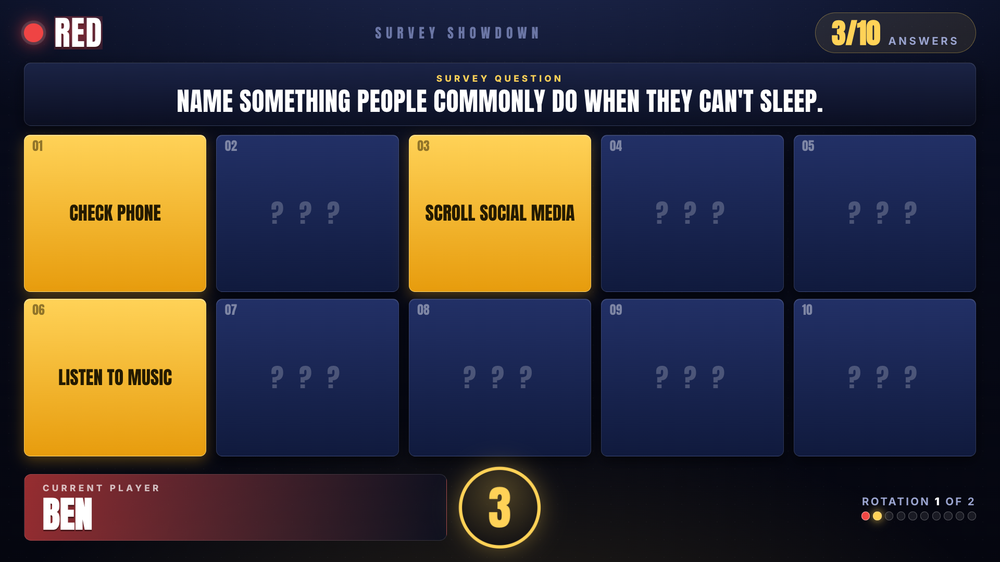
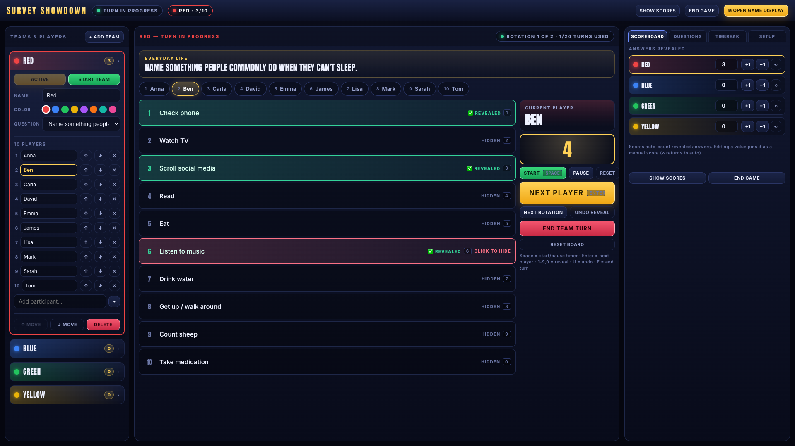

# Mega Family Feud

A host-only, two-screen web app for running a live survey game show (Family Feud + Gimme 5 style)
over a Microsoft Teams call with 40–50 participants.

**Only the host uses the app.** Participants never install, log in, or connect to anything — they
watch the shared window and answer out loud.

| Screen | Window | Who sees it |
| --- | --- | --- |
| **Monitor 1 — Game Display** | `#/display` | Shared fullscreen in Teams: question, ten hidden cards, current player, 5-second countdown, scores |
| **Monitor 2 — Host Control** | `#/host` | Private to the host: teams, players, every hidden answer, timer, scoring, game flow |

Both windows run in the same browser and stay in sync through `BroadcastChannel`, with
`localStorage` as the fallback and as crash/refresh protection. No backend, no accounts, no network
calls at runtime — fonts are bundled, sound effects are synthesized in the browser.

Monitor 1 during a turn, and the host console driving it:





More views in [`screenshots/`](screenshots): scoreboard, tiebreaker, final standings.

---

## How to run on your computer

### 1. Prerequisites

Install these once:

- **Node.js** 18+ (includes `npm`) — download from [nodejs.org](https://nodejs.org/)
- A modern browser: **Chrome** or **Edge** recommended

Check that Node is available:

```bash
node -v
npm -v
```

### 2. Get the project

```bash
git clone https://github.com/TrixiaBelleza/survey-showdown.git
cd survey-showdown
```

Or download the ZIP from GitHub, unzip it, and open a terminal in that folder.

### 3. Install dependencies

```bash
npm install
```

### 4. Start the app

```bash
npm run dev
```

Open the URL Vite prints (usually **http://localhost:5180/**).

### 5. Open the two screens

1. Click **Open Game Display** — drag that window to the monitor you share, then fullscreen it
   (<kbd>F11</kbd> on Windows/Linux, <kbd>⌃</kbd><kbd>⌘</kbd><kbd>F</kbd> on macOS).
2. Click **Open Host Control** — keep this on your private screen.
3. In Microsoft Teams: **Share → Window** and pick the **Game Display** window only
   (not the whole screen, so hidden answers stay private).
4. Optional: tick **Include computer sound** in Teams if you want the audience to hear flip / timer cues.

For the live event, a production build is slightly snappier:

```bash
npm run build
npm run preview
```

Then open the preview URL Vite prints (often **http://localhost:4173/**).

### Useful scripts

| Command | What it does |
| --- | --- |
| `npm run dev` | Start the local development server |
| `npm run build` | Typecheck and build a production bundle into `dist/` |
| `npm run preview` | Serve the production build locally |
| `npm run typecheck` | TypeScript check only |

---

## Setting up your two monitors

1. Click **Open Game Display**. Drag that window to the monitor you plan to share, then press
   <kbd>F11</kbd> (macOS: <kbd>⌃</kbd><kbd>⌘</kbd><kbd>F</kbd>) for fullscreen.
2. Click **Open Host Control** and keep it on your private screen.
3. In Teams choose **Share → Window** and pick the **Game Display** window only. Sharing the window
   (not the whole screen) guarantees your hidden answers never leak.
4. Tick **Include computer sound** in Teams if you want participants to hear the reveal and buzzer cues.
   Sounds play from Host Control (where the host clicks); keep **Game sounds** enabled in Setup.

## Host run of show

1. **Setup tab** — set the game name, paste a roster and **Generate Teams**, or edit teams/players
   manually. Assign a question to each team in the **Questions** tab.
2. Click **Show Rosters** in the top bar so Monitor 1 shows every team and its players ("Find Your
   Team"). Starting a team turn hides it again. The lobby screen also lists all rosters, and the
   active team's players run under the question during a turn with the current player highlighted.
3. Click **Start Game — \<team\>** in the lobby. The question and ten hidden cards appear on Monitor 1.
4. Click a player chip, then **Start** (or <kbd>Space</kbd>) for the 5-second timer. The player's
   name is already on Monitor 1.
5. The player answers verbally. **You are the judge** — there is no automatic matching. If it counts,
   click the answer row (or press its number) and the card flips on Monitor 1.
6. Click **Next Player** (or <kbd>Enter</kbd>). Repeat.
7. The turn runs on the team round timer. End it yourself when time is up, or when all ten answers
   are revealed (the console prompts you). Click **End Team Turn** any time.
8. After **End Team Turn**, Monitor 1 switches to the **STEAL screen**: the leftover board plus every
   *other* team with its players and current points, so the room can see which team a stealer belongs
   to. **Score on flip** turns OFF automatically, so the card you flip for the steal (or for showing
   leftovers) does not add to the team that just played — award the steal with Scoreboard **+1** on the
   stealing team and Monitor 1 updates live. STEAL itself is run manually; see `HOST_SCRIPT.md`.
9. **Next Team →**, and repeat. When every team has played, click **Show Results Board** (team /
   words), then **End Game**.

### Keyboard shortcuts (Host Control only)

| Key | Action |
| --- | --- |
| <kbd>Space</kbd> | Start / pause the 5-second timer (starting again restarts a full 5s) |
| <kbd>Enter</kbd> | Next player |
| <kbd>1</kbd>–<kbd>9</kbd>, <kbd>0</kbd> | Reveal / hide answers 1–10 |
| <kbd>U</kbd> | Undo the last reveal |
| <kbd>R</kbd> | Next rotation |
| <kbd>E</kbd> | End team turn |
| <kbd>S</kbd> | Toggle the results board on Monitor 1 |

Shortcuts are ignored while you're typing in a field.

## Game rules as implemented

- No face-off, no captain, no steals, no strikes, no per-answer point values.
- Each team gets one question with ten hidden answers. The host sees them all; the audience sees cards.
- Players answer in list order, one guess each. After the last player a new rotation starts
  (informational only — there is no rotation cap).
- A turn ends when the **team round timer** runs out or the host clicks **End Team Turn**. Revealing
  all ten answers also prompts the host to end.
- **Score = number of answers revealed**, shown as "Answers Revealed" everywhere. Manual edits come in
  two flavours: `+1` / `+5` / `−1` add a **bonus on top of the live count**, so card flips keep scoring
  afterwards (that's what a STEAL point uses); typing a number **pins** the score and stops the
  automatic count. ⟲ clears both and returns to the pure automatic count.
- **Most words wins.** Ties share the top spot on the Results Board (Team + Words only) — break them
  yourself with Scoreboard `+1` / `−1` if you want a single champion.
- Spare questions in the bank (e.g. night-shift jobs) can be assigned if you generate more than four
  teams. There is no separate ★ #1 tiebreaker round.

## Error prevention

- Confirmation dialogs for resetting a board, deleting a team or question, resetting progress, and
  ending the game.
- Revealed rows are green; hovering a revealed row turns red and reads "click to hide", so reveal and
  hide never look alike.
- **Undo Reveal** steps back through reveals in order.
- **Next Player** is disabled until a player is active; **Start Team** is disabled until the team has
  a question and at least one player.
- Every state change is persisted immediately — refreshing or reopening either window restores the
  live game exactly, including mid-turn.

## Project layout

```
src/
  screens/      Launch, Host (Monitor 2), Display (Monitor 1)
  components/   AnswerCard, TimerReadout, ConfirmModal, host/{TeamsColumn,Console,RightRail}
  store/        gameStore (state + actions), sync (BroadcastChannel + localStorage), selectors
  data/         sampleGame — sample teams, players, and questions
  lib/          sound (WebAudio cues), useCountdown, openDisplay, css, id, generateTeams
  styles/       global, display (Monitor 1), host (Monitor 2), bundled fonts
```

Sample data loads on first run. **Setup → Restore Sample Game** brings the sample bank back after edits.

**Trial Mode** (top bar) keeps your Setup teams and players, swaps in the funny practice questions,
and clears trial scores so you can rehearse. Teams get the trial questions in order (1st, 2nd, 3rd…),
cycling if you have more teams than questions. **Exit Trial Mode** restores the real questions, scores, and progress.

Bundled fonts are Anton and Inter (SIL Open Font License).
